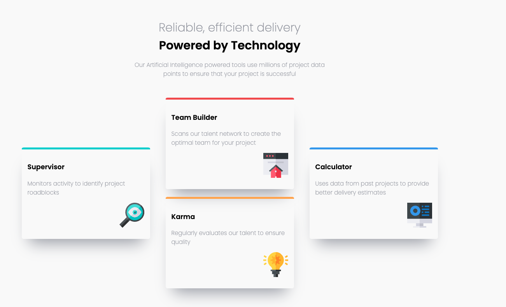
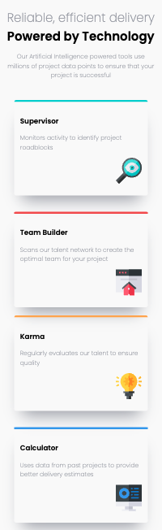

# Frontend Mentor - Four card feature section solution

This is a solution to the [Four card feature section challenge on Frontend Mentor](https://www.frontendmentor.io/challenges/four-card-feature-section-weK1eFYK). It shows four different cards, and has resposive design built in.

## Table of contents

- [Overview](#overview)
  - [The challenge](#the-challenge)
  - [Screenshot](#screenshot)
  - [Links](#links)
- [My process](#my-process)
  - [Built with](#built-with)
  - [What I learned](#what-i-learned)
  - [Continued development](#continued-development)
  - [Useful resources](#useful-resources)
- [Author](#author)
- [Acknowledgments](#acknowledgments)

## Overview
A simple four card layout built with HTML/CSS.

### The challenge

Users should be able to:

- View the optimal layout for the site depending on their device's screen size

### Screenshot

Desktop preview:

Mobile Preview:

### Links

- Solution URL: [https://www.frontendmentor.io/solutions/responsive-four-card-layout-8v3mrZDVJC](https://www.frontendmentor.io/solutions/responsive-four-card-layout-8v3mrZDVJC)
- Live Site URL: [https://whimsical-madeleine-017bcb.netlify.app/](https://whimsical-madeleine-017bcb.netlify.app/)

## My process

1. First I started by drafting on paper what the page should look like. This helped me visualize how to organize the elements on the page, which came in particularly handy with the card layout.
2. Second, I went through index.html and applied the appropriate HTML tags
3. From there I worked on styling the elements

### Built with

- Semantic HTML5 markup
- CSS custom properties
- Flexbox

### What I learned

It is really useful to bring out some pen and a paper and start with sketching out how the page should look before building.

### Useful resources

- [Flexbox](https://developer.mozilla.org/en-US/docs/Learn/CSS/CSS_layout/Flexbox) - This helped me get a better understanding of flexbox.

## Author

- Frontend Mentor - [@rachelpr](https://www.frontendmentor.io/profile/rachelpr)
- Github - [@rachelpr](https://github.com/rachelpr)
